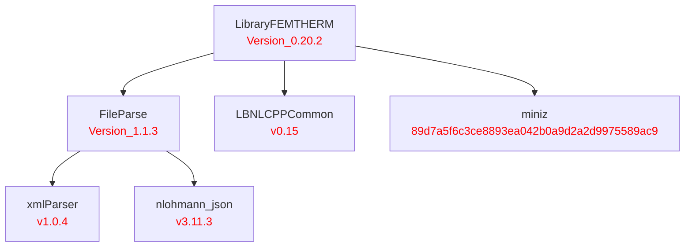

```mermaid
graph TD
    %% Package definitions
    xmlParser[xmlParser<br/><font color='red'>v1.0.4</font>]
    nlohmann_json[nlohmann_json<br/><font color='red'>v3.11.3</font>]
    FileParse[FileParse<br/><font color='red'>Version_1.1.3</font>]
    LBNLCPPCommon[LBNLCPPCommon<br/><font color='red'>v0.15</font>]
    miniz[miniz<br/><font color='red'>89d7a5f6c3ce8893ea042b0a9d2a2d9975589ac9</font>]
    LibraryFEMTHERM[LibraryFEMTHERM<br/><font color='red'>Version_0.20.2</font>]

    %% Package relations
    LibraryFEMTHERM --> FileParse
    LibraryFEMTHERM --> LBNLCPPCommon
    LibraryFEMTHERM --> miniz
    FileParse --> xmlParser
    FileParse --> nlohmann_json
```
